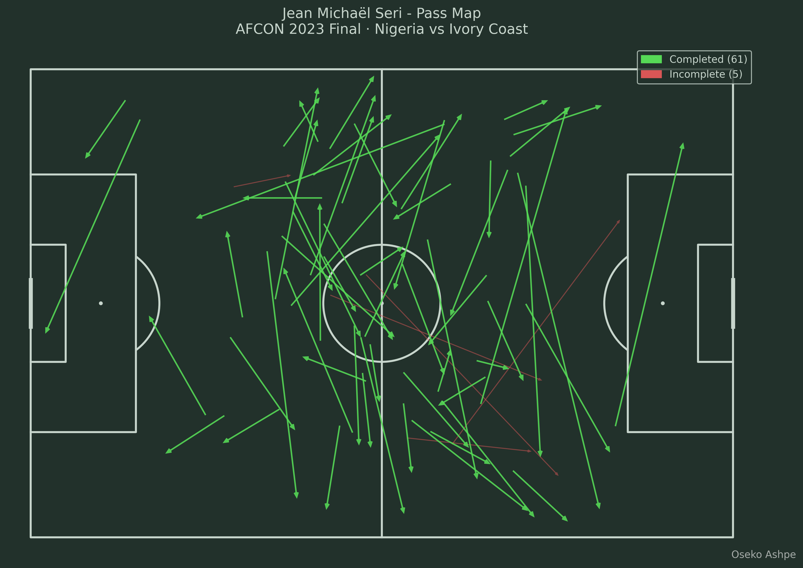
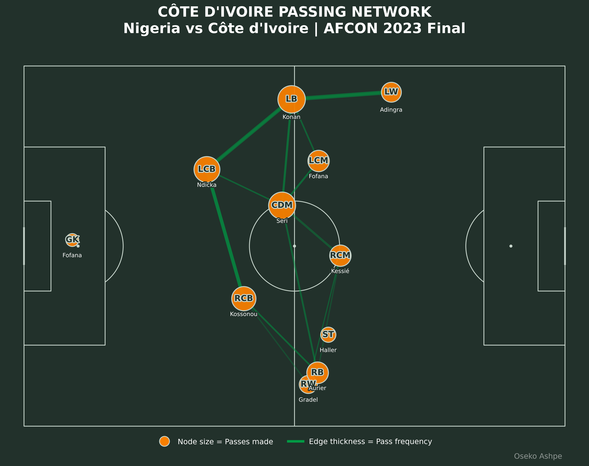

# AFCON 2023 Final - Passing Analysis using Python

This project analyzes individual and team passing behaviour using StatsBomb open event data and Python, examining:

**Nigeria vs Côte d'Ivoire - AFCON 2023 Final**

It breaks down a single player's distribution patterns and a team's overall passing structure, turning raw event data into visual, tactical insight. This is the kind of analysis used in scouting, tactical prep, and post match review.

## Project Overview

**Player Pass Map**: every pass attempted by a single player, split into completed and incomplete, showing volume, accuracy, and zones of influence.

**Team Passing Network**: passes aggregated into a network where:

* Nodes represent players, sized by passing involvement
* Edges represent connections between players, with thickness showing pass frequency

## Example Output

**Player Pass Map** (Jean Michaël Seri, Côte d'Ivoire)



**Team Passing Network** (Côte d'Ivoire)



## Data Source

[StatsBomb Open Data](https://github.com/statsbomb/open-data), free event level football data for research and education.

## Tech Stack

Python, pandas, numpy, mplsoccer, statsbombpy, matplotlib

## Project Structure

```
afcon-2023-final-passing-analysis/
│
├── pass_map.ipynb                    # Player pass map (Jean Michaël Seri)
├── passing_network.ipynb             # Team passing network (Côte d'Ivoire)
├── requirements.txt
├── README.md
│
├── images/
│   ├── pass_map.png
│   └── passing_network.png
│
└── report/
    └── Passing_Analysis_Report.pdf   # Full written report
```

## Key Insights

* Seri operated as a deep lying playmaker, with high volume and strong accuracy (92%)
* Côte d'Ivoire's build up was left sided and centrally organised
* Konan, Ndicka, Kossonou and Seri were the primary distribution hubs
* The right flank was comparatively underused

## Report

Full methodology and interpretation: [Passing Analysis Report](report/Passing_Analysis_Report.pdf)

## Purpose

Part of my personal portfolio in football data science, applying event data analysis and network visualization in Python to a real competitive fixture.

## Author

Oseko Ashpe
Football Data Analyst
LinkedIn: https://www.linkedin.com/in/ashpe-ayubu
GitHub: https://github.com/ashpe-osk
